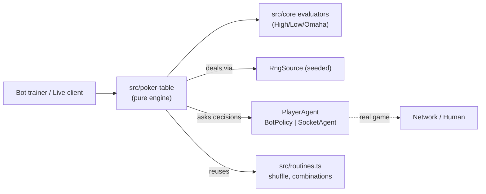
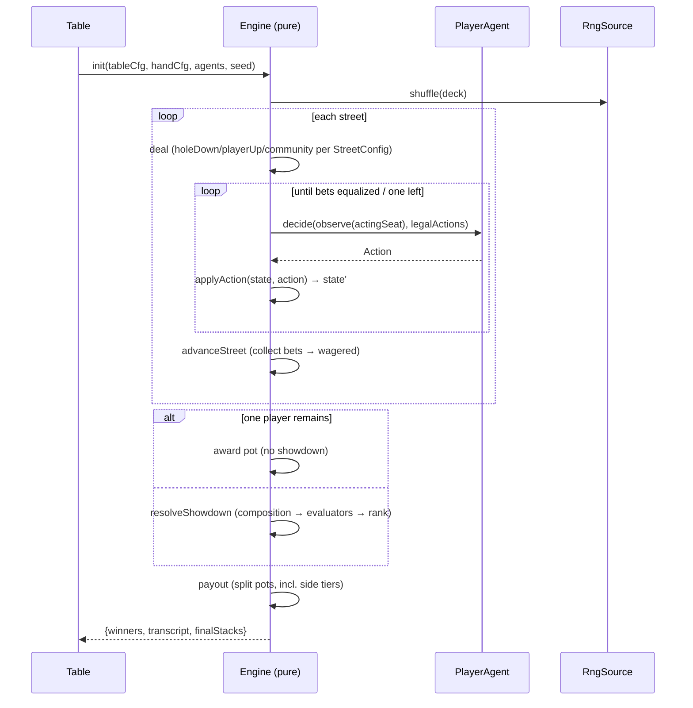
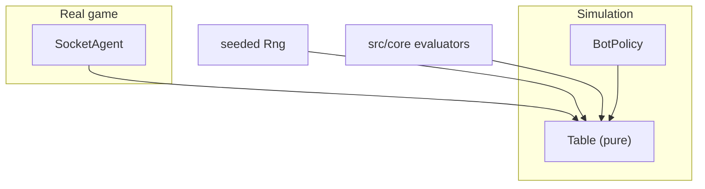
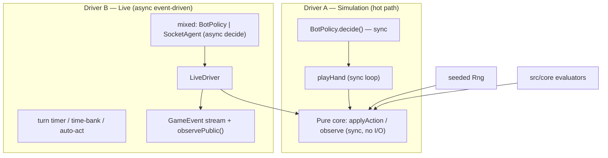

# Design — `configurable-poker-table` Engine Architecture

**Wave:** DESIGN · **Consumes:** `feature-delta.md`, `slices/slice-NN-*.md` · **Handoff to:** DELIVER (slice 01)

This is the normative architecture for the `src/poker-table/` module. It supersedes the non-existent module described in `docs/architecture.md`.

---

## 1. Design principles (from DISCUSS decisions)

- **[D1] Pure deterministic core.** All game logic is pure functions of `(state, action)`. The only nondeterminism — the deal — comes from an injected, seeded `RngSource`. No `Math.random()` in `src/poker-table/`.
- **Ports over branches.** Betting type, evaluation, and decision source are *injected/configured*, not `switch`-cased in the core. One `computeLegalActions` and one `resolveHand` serve every variant.
- **Reuse, don't rebuild.** Ranking delegates to `src/core/{HighEvaluator,Low8/Low9,OmahaEvaluator,OmahaHiLoEvaluator}`. Zero new evaluators.
- **One engine, two drivers.** Simulation and live play differ only in the `PlayerAgent` implementation (bot policy vs socket/human). The state machine is identical.
- **The observation shape is load-bearing.** `Observation` (slice 03) is the hardest surface to change once bots depend on it — it is designed first and defended by tests.

---

## 2. C4 — context & containers



Containers: the engine is a single in-process library (no server, no transport). The `SocketAgent` is the *port* that adapts a real game; the wire protocol is out of scope.

---

## 3. Module layout

```
src/poker-table/
├── config/
│   ├── types.ts        # TableConfig, HandConfig, StreetConfig, BettingConfig, ForcedBetConfig, EvaluationConfig, CompositionSelector
│   ├── validate.ts     # compileConfig() → validated Rules; rejects impossible compositions/stacks
│   └── presets.ts      # holdem(), omaha(), stud(), razz(), omahaHiLo(), draw() builders
├── engine/
│   ├── state.ts        # GameState, SeatState, Pot, Action (immutable shapes)
│   ├── actions.ts      # Action union + computeLegalActions(state, rules)
│   ├── transitions.ts  # pure: init, deal, applyAction, closeBettingRound, advanceStreet, resolveShowdown, payout
│   ├── pot.ts          # buildPots(wagered, status) → Pot[] (main + side tiers)
│   └── rng.ts          # RngSource interface + createRng(seed) (Mulberry32, port from poker-sym)
├── evaluation/
│   ├── composition.ts  # enumerateCombinations + patternOk + resolveHand
│   └── resolver.ts     # evaluator name → src/core fn; ranking direction; low-qualify wiring
├── agents/
│   ├── types.ts        # PlayerAgent { decide, onEvent? }
│   ├── stub.ts         # always-call / random-legal (tests + skeleton)
│   └── remote.ts       # SocketAgent adapter (real-game port)
├── table.ts            # Table session: step()/observe() (RL + live) + playHand() convenience
└── index.ts            # public exports
```

---

## 4. Core types

### 4.1 Game state (immutable; transitions return copies)

```ts
interface GameState {
  tableCfg: TableConfig;
  handCfg: HandConfig;          // active per-hand config (mutable hand-to-hand)
  buttonSeat: number;
  seats: SeatState[];
  community: number[];          // card indices
  streetIndex: number;
  phase: 'dealing' | 'betting' | 'showdown' | 'payout' | 'terminal';
  pots: Pot[];                  // main (+ side tiers, slice 06)
  bets: number[];               // current-street contribution per seat
  wagered: number[];            // total wagered this hand per seat (side-pot input)
  actingSeat: number;
  lastAggressor: number | null;
  lastRaiseSize: number;        // min-raise floor
  actionsThisStreet: Action[];
  deck: number[];               // remaining deal order (advanced by rng)
  winners?: PotWinner[];
  isTerminal: boolean;
}
interface SeatState {
  index: number; stack: number;
  hole: number[]; up: number[];          // up = stud exposed doors
  status: 'active' | 'folded' | 'allin' | 'out';
  hasActedThisStreet: boolean;
}
interface Pot { amount: number; eligible: number[]; }
interface Action {
  type: 'fold' | 'check' | 'call' | 'bet' | 'raise' | 'allin';
  seat: number; amount?: number; to?: number; streetIndex: number;
}
interface PotWinner { seat: number; potIndex: number; amount: number; rank: number; }
```

### 4.2 Ports

```ts
interface PlayerAgent {
  decide(observation: Observation, legalActions: Action[]): Action | Promise<Action>;
  onEvent?(event: GameEvent): void;            // deal, street-advance, showdown, etc.
}
interface RngSource {
  nextInt(maxExclusive: number): number;
  shuffleInPlace<T>(arr: T[]): T[];
}
```

### 4.3 Observation (RL surface — defended by tests)

```ts
interface Observation {
  seat: number;
  street: string;               // handCfg.streets[streetIndex].name
  myHole: number[];             // this seat's hole cards ONLY
  community: number[];
  up: { seat: number; cards: number[] }[];   // exposed doors (stud); NO opponent hole
  myStack: number;
  pot: number;                  // sum of all pots
  toCall: number;               // max bet - my current street bet
  minRaiseTo: number; maxRaiseTo: number;    // betting bounds this action
  players: PlayerPublicView[];  // stacks, bets, status — NEVER hole cards
  actionHistory: Action[];
  isTerminal: boolean;
  legalActions: Action[];
}
interface PlayerPublicView { seat: number; stack: number; bet: number; status: SeatState['status']; }
```

The information barrier is **enforced by construction**: `observe(seat)` builds `players` from public fields only; a property test (slice 03) asserts no opponent hole-card index ever appears.

---

## 5. State machine / hand flow



- **Betting round closes** when all active seats have `hasActedThisStreet` and `bets` are equal, or only one non-folded seat remains.
- **Street advance** collects `bets` into `wagered`, resets `bets`, deals the next `StreetConfig.deal`, sets `actingSeat` per `actionOrder`.
- **`actionOrder`** → postflop/holdem: left-of-button; stud: low upcard (`low-upcard`) / high hand (`high-hand`) determines bring-in seat.

---

## 6. Legal-action generation (one function, all betting types)

```ts
function computeLegalActions(state, rules): Action[]
```

- `toCall = max(bets) - bets[actingSeat]`.
- **No-limit / pot-limit:** `maxRaiseTo = stack + wagered`; PL caps raise so total put in ≤ pot + to-call. `minRaiseTo = currentMax + max(lastRaiseSize, bigBet)`.
- **Fixed-limit:** bet/raise is exactly `smallBet` (early streets) or `bigBet` (late); `maxRaisesPerStreet` caps count; "bet doubling" is street-index-driven.
- `toCall === 0` → `{check, bet/allin}`; `toCall > 0` → `{fold, call, raise/allin}`. All-ins clamped to stack; under-minimum all-in allowed only if it is the actor's entire remaining stack.

Betting type is read from `rules` (compiled from `BettingConfig`); **no per-type branches leak into the core loop** — only `computeLegalActions` and the bet-sizing helper vary.

---

## 7. Pot resolution (side pots, slice 06)

```ts
function buildPots(wagered: number[], status: Status[]): Pot[]
```

1. Collect total `wagered` per seat; ignore folded seats for *eligibility* but their money stays in the pot.
2. Levels = sorted unique `wagered` values of contributing seats.
3. For each adjacent level pair `⟨prev, cur⟩`: tier amount = `(cur − prev) × count(seats with wagered ≥ cur)`. Eligible = non-folded seats with `wagered ≥ cur`.
4. Uncalled overbet (one seat bet more than anyone could match) returned to that seat.
5. Each tier evaluated independently → `PotWinner[]`. Zero-sum verified per hand.

---

## 8. Composition selector (the unifying abstraction)

```ts
function resolveHand(pools: CardPools, selector: CompositionSelector,
                     evaluator: EvalFn, ranking: 'high-wins'|'low-wins'): HandResult
```

1. **Enumerate** combinations respecting `exactly/min/max` per pool and `total` (Hold'em: C(7,5)=21; Omaha: C(4,2)×C(5,3)=60).
2. **Filter** by per-pool `pattern` (`patternOk`): named (`pair/trips/flush/straight`) or custom predicate — slice 08.
3. **Rank** each survivor via the mapped `src/core` evaluator.
4. **Select** best per `ranking` (high-wins = strongest; low-wins = weakest, for Razz).

`resolver.ts` maps `EvaluationConfig.evaluator` → the existing evaluator fn and applies `lowQualify` at the **pot layer** (not evaluator layer): a low half-pot is created only when a qualifying low exists.

---

## 9. Determinism & replay

- The RNG is the sole nondeterminism, fully controlled by `seed`.
- **Replay material = `(seed, actionLog)`** — re-running from seed with the same actions reproduces the hand byte-for-byte. Snapshot/resume (slice 02) = store seed + actions, reapply. No need to serialize RNG internals.
- A lint/grep guard forbids `Math.random` in `src/poker-table/`.

---

## 10. Sim vs live — identical core



`BotPolicy` and `SocketAgent` both implement `PlayerAgent`. The core never knows which is driving — `decide()` returns an `Action` either way. This is how one engine serves both (S7).

---

## 11. Testing strategy

- **TDD** red→green per AGENTS.md; >95% coverage.
- **Golden-hand suite:** fixed fixtures (incl. the multi-way all-in and the invented pair/trips variant) with expected payouts.
- **Cross-check:** engine showdown winner == `PokerEvaluator.evaluate7Cards` / `OmahaEvaluator` on identical cards (anchors the new engine to the trusted lib).
- **Property tests:** zero-sum (Σ deltas = 0) over 10k random hands; hidden-info (no opponent hole in `Observation`); replay-identical from `(seed, actions)`.
- **Perf:** ≥10k hands/sec heads-up benchmark (`vitest.perf.config.ts`).

---

## 12. Slice → module mapping (build order)

| Slice | Adds modules |
|---|---|
| 01 skeleton | `config/{types,validate}`, `engine/{state,actions,transitions,rng}`, `agents/stub`, `table.playHand` (high eval only) |
| 02 replay | transcript + snapshot/resume, RNG into replay |
| 03 step API | `table.step/observe`, `Observation` |
| 04 composition | `evaluation/{composition,resolver}`, Omaha/Stud presets |
| 05 betting | full `computeLegalActions` (PL/FL), `forcedBets` (antes/bring-in) |
| 06 side pots | `engine/pot.buildPots`, 3+ seats |
| 07 hi-lo | low-qualify at pot layer, A5/2-7/low8/low9 wiring, ranking direction |
| 08 patterns | `patternOk` named+custom in `evaluation/composition` |

---

## 13. Risks & mitigations

- **Observation shape churn** → design it now (§4.3), freeze at slice 03, guard with property tests.
- **Perf of combinatoric enumeration** → trivial (≤60 combos); only matters if patterns force full enumeration with custom predicates — benchmark in slice 08.
- **Config validation explosions** → `validate.ts` rejects impossible configs early (e.g., `trips` pattern on a 2-card pool, stacks < blinds, seat count > dealt cards).
- **Real/sim drift** → one core, one `PlayerAgent` interface; S7 cross-test runs the same fixture through both a bot and a recorded socket feed.

## 14. Real-time & Mixed-Play

The pure core (§4–§9) is identical for simulation and live play. Dual-use is achieved with **two drivers over the same core** — the core and the sim hot-path are never modified for real-time needs.



### 14.1 Driver A — `playHand` (simulation, sync)
Blocking synchronous loop; bots only; no `await`, no event emission on the hot path. This is the ≥10k hands/sec path. Replay = `(seed, actionLog)`.

### 14.2 Driver B — `LiveDriver` (live, async event-driven)
Turn-by-turn over `step()`; `await`s each `decide()` so a slow human never blocks; yields control between actions. Mixed rosters fall out for free — each seat has its own `PlayerAgent`.

```ts
class LiveDriver {
  constructor(table: Table, seats: (PlayerAgent | null)[], clock: TurnClock);
  async *run(): AsyncIterable<GameEvent>;        // UI / spectator subscribes
  async submitAction(seat: number, a: Action): void;  // human / UI input
  pause(): void; resume(): void;
}
```

### 14.3 UI event stream & spectator view
- `GameEvent` union: `deal`, `street-advanced`, `action`, `pot-updated`, `your-turn`, `showdown`, `hand-ended`. `LiveDriver` emits it; the UI/spectator subscribes (independent of the per-agent `onEvent`).
- `table.observePublic()` — community / pots / stacks / bets / action history only (no hole cards); for spectators and the lobby. `observe(seat)` stays the private per-player view.

### 14.4 Turn clock & auto-action
`TurnClock` (driver-layer): per-action time limit + time bank; on expiry → auto-fold (facing a bet) or auto-check (no bet). Legality still comes from `computeLegalActions`; the clock only supplies a default action.

### 14.5 Reconnect / pause / resume via state hydration
`GameState` is plain serializable data → add `serialize(state): string` and `hydrate(json): { state, tableCfg, handCfg }` for **O(1)** mid-hand resume. This is distinct from the O(actions) `(seed, actionLog)` replay used for sim determinism: a reconnecting human rehydrates and continues from the exact mid-hand state.

### 14.6 Sit-out / late-join / bot-fill
Session-layer over `SeatState.status`:
- `sitting-out` → skipped in turn order; blind due-or-waived per rule.
- Hand-boundary join — new seats sit in at the next hand start.
- `botFill` flag — an empty/sitting-out seat auto-occupied by a bot policy (keeps a table shorthanded).

### 14.7 Performance boundary (guarded)
Event emission, awaiting, timers, and hydration live **only** in Driver B / the session layer. Driver A (`playHand`) and the pure core remain allocation-light and `await`-free, preserving the ≥10k hands/sec sim target. A regression test asserts the sim path is unaffected when Driver B is absent.

> These capabilities reuse the seams defined in §4 (`PlayerAgent`, `RngSource`) and §4.3 (`Observation`); they are delivered as driver/session-layer slices after the core slices (01–08), with no changes to the pure core or the sim hot-path.

## 15. Non-goals (architecture)

No persistence, no transport protocol, no GUI, no tournament scheduler, no collusion/rake logic. The engine is a pure library; everything else composes on top via the `PlayerAgent`/`RngSource` ports.

---

**Ready for DELIVER (slice 01).** The skeleton builds `config/`, `engine/` core, `agents/stub`, and `table.playHand` for heads-up NL high-only, cross-checked against `PokerEvaluator.evaluate7Cards`.
