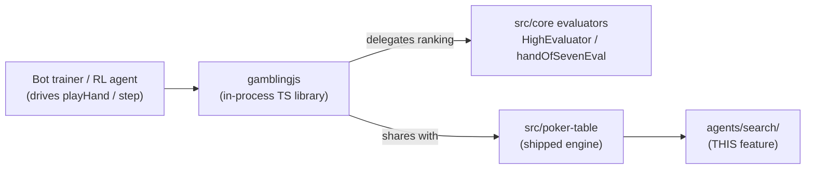
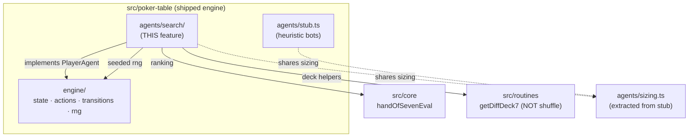
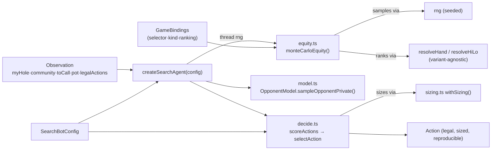

# Design — `tunable-search-bot` Agent Architecture

**Wave:** DESIGN · **Scope:** Application / components (nw-solution-architect / Morgan) · **Mode:** Propose
**Consumes:** `feature-delta.md` (DISCUSS [D1]–[D7]), `slices/slice-0[1-5]-*.md`, predecessor `configurable-poker-table/design/architecture.md` · **Handoff to:** DISTILL (acceptance tests) + DEVOPS (KPIs)

Normative architecture for the new `src/poker-table/agents/search/` module. It is an **additive module on the shipped engine** — it consumes (does not modify) `engine/`, `src/core`, `src/routines`, and the frozen `Observation` surface.

---

## 1. Design principles (from DISCUSS decisions)

- **[D1] Online, training-free.** Every decision is re-derived from the observation. No solve step, no network. The architecture must not introduce any precompute or model-training path.
- **[D8] Variant-agnostic core, day 1 (universality).** The bot adapts to **any** variant (Hold'em, Omaha, Hi/Lo, Razz, 2-7, Stud, Draw) and **any** bet type (NL/PL/FL/Spread) with **zero per-variant branching in the bot**. It achieves this by reusing the engine's existing variant abstractions — `resolveHand`/`resolveHiLo` + `CompositionSelector` + `EvaluatorKind`/`RankingDirection` — bound from the game's `EvaluationConfig`. The bot never calls `handOfSevenEval` directly. (Supersedes the original [D5] "Hold'em-only"; see §17 Changed Assumptions.)
- **[D2] Forward-compatible config.** `SearchBotConfig` declares *all* knobs (Phase 1/2/3) on day 1. Phase-1 code reads a subset; the rest are reserved-but-validated. A saved config is a stable, comparable artifact across phases.
- **[D3] Rollouts drive the shipped engine.** No second game model. Phase 1 needs only the evaluator + deck + seeded RNG; Phase 3 (IS-MCTS) additionally reuses `engine/transitions` + `engine/actions` to play out betting.
- **[D4] Determinism via one seeded RNG.** Exactly one `RngSource` is created from `config.seed` at factory time and threaded through **every** sampling call (equity, action selection, bluff, sizing). **`Math.random` is forbidden** in `agents/search/`.
- **[D5] Multi-way is the only deferred axis.** Heads-up is the v1 exercise (clean, tractable, literature-backed), but the **equity signature is multi-way-capable from day 1** (`nOpponents` parameter) so Phase 4 does not break the [D7] leaf. Every *variant* (Omaha/Stud/Razz/Hi-Lo/Draw) works from day 1 via [D8]; only N>2 opponents ships later.
- **[D7] Equity is the IS-MCTS leaf.** `monteCarloEquity(...)` is designed once and reused as the leaf value function in Phase 3 — its signature is stable and variant/multi-way-aware from day 1.
- **Reuse, don't rebuild.** The bot reuses the shipped evaluator, RNG, deck routines, and the existing gaussian-sizing helper; it adds only the decision pipeline. (See §4 Reuse Analysis.)

---

## 2. Quality attributes & constraints (Discovery steps 1–3)

**Ranked quality attributes:**
1. **Testability / correctness** — highest. The bot exists for RL benchmarking; wrong equity or non-reproducible play invalidates baselines.
2. **Performance (latency + throughput)** — `decide()` p95 < 5ms; `playHand` ≥ 5k hands/sec heads-up. Equity-bound.
3. **Maintainability / configurability** — config must absorb Phases 2–3 without shape churn.
4. **Reusability** — equity primitive reused as Phase-3 leaf ([D7]); rollouts reuse the engine ([D3]).

**Constraints:** TS ESM, strict, ES2020, **zero runtime dependencies** (AGENTS.md) — no new deps. Reuse `src/core` evaluators, `src/routines` (deck helpers only), `engine/rng`. Frozen `Observation` shape (predecessor slice 03) — the bot must require **no** `Observation` changes (the variant is bound at construction via `GameBindings`, not read from a new field). Variant-agnostic core from day 1 ([D8]); heads-up is the v1 exercise, multi-way the only deferred axis ([D5]). Single bounded context (`poker-table`); single "team" (solo dev) — no Conway's-Law pressure.

**Paradigm: Functional** (selected — see ADR-2). Consistent with the predecessor's pure-deterministic-core design and the `agents/stub.ts` factory pattern (`createRandomAgent(seed): PlayerAgent`). Pure functions, immutable data, one factory; **no class hierarchy**.

---

## 3. Architecture pattern

**Modular library + hexagonal alignment with the engine, functional decision pipeline, config-driven strategies (ports over branches).** No override of the modular-monolith+DIP default is needed — it is the established pattern and matches the predecessor exactly.

The bot sits on **two ports** of the existing engine:
- It **implements** the engine's `PlayerAgent` port (`decide(observation) → Action`) — from the engine's view it is a *driven adapter*.
- It **exposes** `createSearchAgent(bot, game): PlayerAgent` — from the library's view a *driving port* (public factory).
- It **consumes** driven ports: the engine's variant resolver (`resolveHand`/`resolveHiLo` + `CompositionSelector`), the seeded RNG (`createRng`), and deck helpers (`getDiffDeck7`). It does **not** import any evaluator directly — that is what makes it variant-agnostic ([D8]).

---

## 4. Reuse Analysis (HARD GATE — RCA)

| Existing component | File | Overlap with new design | Decision | Justification |
|---|---|---|---|---|
| Hand-distribution MC | `src/pokerMontecarloSym.ts` (`getPartialHandStatsIndexed_7`) | Samples deck + evaluates 7-card hands | **CREATE NEW** | Returns `handCategoryDistribution` (category *frequencies*); the bot needs expected pot-*share* vs sampled opponents. Different output contract; extending would change the return type. Shared primitive is only the sample loop. |
| Variant hand resolution | `src/poker-table/evaluation/resolver.ts` (`resolveHand`, `resolveHiLo`) + `composition.ts` (`enumerateCompositions`, `ResolvedPools`) | Rank any hand for any variant/composition | **REUSE (primary, [D8])** | The engine already maps `EvaluatorKind`→evaluator and enumerates compositions (Omaha 2/3, Stud own-7, patterns). The bot calls `resolveHand`/`resolveHiLo` per sample — this is what makes the bot variant-agnostic with zero per-variant branching. |
| Evaluators | `src/core/{HighEvaluator,LowAto5Evaluator}`, `pokerEvaluator7` | Raw ranking | **REUSE (indirect)** | Reached *through* `resolveHand`; the bot never imports an evaluator directly. |
| Deck shuffle | `src/routines.ts:1` (`shuffle`) | Shuffling the partial deck per sample | **REJECT — do not use** | Uses `Math.random()` (routines.ts:8) → **non-deterministic**, violates [D4]. Use seeded `RngSource.shuffleInPlace` instead. (See ADR-3.) |
| Seeded RNG | `src/poker-table/engine/rng.ts` (`createRng` → `RngSource`) | All sampling randomness | **REUSE** | Already the engine's sole nondeterminism source; import `createRng(config.seed)`. |
| Deck differencing | `src/routines.ts:88` (`getDiffDeck7`) | Remove known hashes from the deck | **REUSE** | Pure (no RNG); gives the unseen-card pool. |
| Combinations | `src/routines.ts:18` (`combinations`) | Enumerate opponent combos (Phase 2 ranges) | **REUSE (Phase 2)** | Reserved for non-uniform ranges; not needed in Phase 1. |
| Agent factory + sizing | `src/poker-table/agents/stub.ts` (`createRandomAgent`, `withSizing`, `gaussFrac`, `gaussianUnit`) | Factory shape; gaussian bet sizing | **EXTEND (extract)** | `createSearchAgent` mirrors the factory; sizing logic should be shared, not duplicated. Extract `withSizing`/`gaussFrac`/`gaussianUnit` into `agents/sizing.ts` and import from both `stub.ts` and `searchAgent.ts` (behavior-preserving; F-4 strategy extraction). *Minimal alternative if blast-radius is a concern:* additive re-export from `stub.ts`. |
| Smart-bot context + discard | `src/poker-table/agents/smart.ts` (`analyzeObservation`, `madeStrength`, `chenStrength`) + `agents/discard.ts` (`discardAction`) | Pot-odds/position/pressure context; draw-game discard; starting-hand strength | **REUSE** | The search bot reuses `analyzeObservation` (pot odds, opponents, position) and `discardAction` verbatim. It does NOT reuse the *decision policy* — that is the new equity-driven code. `smart.ts` is the heuristic sibling; `search/` is the Monte-Carlo sibling. (Discovered during DELIVER — was absent from the original table.) |
| Legal-action picking | `agents/stub.ts` (`findType`, `fallback`), `agents/discard.ts` (`discardAction`) | Fold/call/check/bet/raise discovery; draw games | **REUSE** | Use the same helpers so the bot handles `discard` actions consistently (stud/draw future). |
| Game simulator (rollouts) | `src/poker-table/engine/{state,actions,transitions}.ts` | Phase 3 IS-MCTS rollouts | **REUSE (Phase 3)** | Clone `GameState` (plain serializable data), assign opponent hole, drive `applyAction`/`computeLegalActions` to showdown. Not used in Phase 1 (equity only samples cards, not betting). |

**Net new code:** the decision pipeline (`config.ts`, `equity.ts`, `range.ts`, `decide.ts`, `searchAgent.ts`) + the `sizing.ts` extraction. Zero new evaluators, zero new RNG, zero new game model, zero new dependencies.

---

## 5. C4 — System Context



The "system" boundary is the library; the external actor is the developer/RL loop. The search module is a new component *inside* the `poker-table` container.

## 5b. C4 — Container



## 5c. C4 — Component (the decide pipeline)



---

## 6. Module layout

```
src/poker-table/agents/
├── sizing.ts        # NEW (extracted): withSizing, gaussFrac, gaussianUnit — shared by stub.ts + search/
├── stub.ts          # MODIFIED (import sizing from ./sizing; behavior unchanged)
├── search/          # NEW — this feature
│   ├── config.ts    # SearchBotConfig (behaviour knobs), defaults, validateSearchBotConfig(); GameBindings type
│   ├── model.ts     # OpponentModel interface + uniformModel (Phase 1); bayesian reserved (Phase 2)
│   ├── equity.ts    # monteCarloEquity(myPools, selector, kind, ..., model, nOpponents, nSamples, rng) [D7 leaf, variant-aware]
│   ├── decide.ts    # scoreActions(obs, equity, bot); selectAction(scored, bot, rng) — pure
│   └── searchAgent.ts # createSearchAgent(bot, game): PlayerAgent — composes the above, owns the one RNG
└── ... (existing)
```
Exports: `createSearchAgent`, `SearchBotConfig`, `validateSearchBotConfig`, `monteCarloEquity` (public, for direct use/testing) → `agents/search/index.ts` → `poker-table/index.ts`.

---

## 7. Core types (contracts — no implementation bodies)

### 7.1 Config (forward-compatible — [D2])
```ts
interface SearchBotConfig {
  seed: number;
  // --- Phase 1 (used) ---
  equitySamples: number;            // MC samples per equity estimate (default 20000)
  temperature: number;              // softmax sharpness over action utilities; 0 = greedy (default 0.3)
  epsilon: number;                  // ε-greedy noise, secondary dial (default 0)
  bluffFrequency: number;           // P(raise/bet a weak hand) (default 0.05)
  potOddsTolerance: number;         // continue if equity ≥ potOdds·(1 − tol) (default 0.1)
  sizing: { mean: number; sigma: number }; // gaussian bet fraction within [min,max] (default {0.5,0.18})
  opponentModel: 'uniform';         // Phase 1 = 'uniform' only; 'bayesian' rejected by validator until Phase 2
  // --- Phase 2/3 (reserved: validated, unused) ---
  explorationC: number;             // UCB1 Cp for IS-MCTS (default 0.7)
  treeIterations: number;           // IS-MCTS simulations/decision (default 10000)
  maxDepthStreets: number;          // IS-MCTS lookahead cap in streets (default 1)
}
function validateSearchBotConfig(c: SearchBotConfig): SearchBotConfig; // throws on ranges; blocks 'bayesian' in Phase 1
```

### 7.2 Opponent private pool (variant-aware — replaces "hole pair")
```ts
type CardIdx = number;                 // 0..51
interface OpponentModel {
  /**
   * Draw ONE opponent's full private pool (hole + door, per the hand's DealConfig)
   * consistent with all known cards — my hole, community, and visible upcards (obs.up).
   * Returns as a ResolvedPools fragment the equity step merges with the sampled board.
   * Count of cards drawn is variant-driven: Hold'em=2, Omaha=4, Stud=variable, Draw=5.
   */
  sampleOpponentPrivate(unseen: CardIdx[], nPrivate: number, rng: RngSource): CardIdx[];
}
const uniformModel: OpponentModel;     // Phase 1: seeded shuffle, take first nPrivate
```
`nPrivate` is derived from the bound `EvaluationConfig`/`HandConfig` (private-pool size). Phase 2 (`bayesian`) narrows the unseen-pool by `actionLog` + `obs.up`; the interface is unchanged.

### 7.3 Equity (the [D7] leaf — variant + multi-way aware, stable across phases)
```ts
interface EquityResult {
  /** Expected share of the pot in [0,1]. 1 = certain win, 0.5 = even chop, etc. */
  equity: number;
  // hi-lo breakdown (populated only for evaluator 'hi-lo'; equity = highShare+lowShare)
  high?: number; low?: number;
}
function monteCarloEquity(
  myPools: ResolvedPools,          // { hole: myHole, door: myUp, community }
  selector: CompositionSelector,   // from the bound EvaluationConfig (Omaha 2/3, Stud own-7, ...)
  kind: EvaluatorKind,             // 'high' | 'A5-low' | '2-7-low' | 'low8' | 'low9' | 'hi-lo'
  ranking: RankingDirection,
  lowQualify: 8 | 9 | undefined,
  model: OpponentModel,
  nOpponents: number,              // from obs (non-folded others); v1 = 1
  nSamples: number,
  rng: RngSource,
): EquityResult;
```
Per sample: build unseen = full deck − myPools − community − visible upcards; draw `nOpponents` private pools + complete the board to the hand's community size; rank every hand via **`resolveHand(...)`** (or **`resolveHiLo(...)`** for `kind:'hi-lo'`) — **never a direct `handOfSevenEval` call**. Tally my pot-share (hi-lo: high-half + low-half shares; no qualifying low → high scoops). `equity` is a scalar usable by `decide`/IS-MCTS leaf regardless of variant.

### 7.4 Decision pipeline (pure)
```ts
interface ScoredAction { action: Action; utility: number; }
function scoreActions(obs: Observation, equity: EquityResult, cfg: SearchBotConfig): ScoredAction[];
function selectAction(scored: ScoredAction[], cfg: SearchBotConfig, rng: RngSource): Action;
```

### 7.5 Public factory (binds the game — [D8])
```ts
/**
 * @param bot  tunable behaviour (difficulty, sizing, seed, reserved Phase-2/3 knobs)
 * @param game the variant this agent plays — evaluator, ranking direction,
 *             composition selector, low qualifier, private-pool size.
 *             Sourced from the table's HandConfig.evaluation (the engine's own config).
 */
function createSearchAgent(bot: SearchBotConfig, game: GameBindings): PlayerAgent;

interface GameBindings {
  selector: CompositionSelector;
  kind: EvaluatorKind;
  ranking: RankingDirection;
  lowQualify?: 8 | 9;
  communitySize: number;   // cards dealt to the board (0 for Stud/Draw)
  privatePoolSize: number; // opponent private cards to sample (2 Hold'em, 4 Omaha, …)
}
```
The agent is **bound to one game at construction**; it does not need (and must not require) any change to the frozen `Observation`. Different variants → different `GameBindings`, same bot code.

---

## 8. `decide()` data flow

1. `createSearchAgent(bot, game)` creates **one** `rng = createRng(bot.seed)`, a `model = uniformModel` (Phase 1), and stores `game` (selector/kind/ranking/lowQualify/sizes).
2. `decide(obs)`:
   a. Build `myPools = { hole: obs.myHole, door: obs.up.find(me)?.cards ?? [], community: obs.community }`. Derive `nOpponents = count of non-folded others in obs.players`.
   b. `equity = monteCarloEquity(myPools, game.selector, game.kind, game.ranking, game.lowQualify, model, nOpponents, bot.equitySamples, rng)` — for each of `nSamples`: unseen = deck − myPools − community − all visible upcards; draw `nOpponents` private pools (`game.privatePoolSize`) + complete the board to `game.communitySize`; rank everyone via `resolveHand`/`resolveHiLo`; tally my expected pot-share into the scalar `equity.equity` (hi-lo: `high`+`low`).
   c. `scored = scoreActions(obs, equity.equity, bot)` — map each legal action to a utility (bet/raise favored when `equity` clears pot odds; fold when below the gate `equity ≥ potOdds·(1 − potOddsTolerance)`).
   d. `selectAction(scored, bot, rng)` — softmax over utilities at `temperature` (greedy at 0) **or** ε-greedy at `epsilon`; inject a bluff (raise weak) with probability `bluffFrequency`; size bet/raise via `withSizing(rng, sizing.mean, sizing.sigma)`.
   e. return a legal, sized, reproducible `Action`.
3. Discard actions (stud/draw) are handled first via the shared `discardAction(obs)` helper (consistent with stub bots).

**Pot-odds inputs** come from the frozen `Observation`: `toCall` and `pot` → `potOdds = toCall / (pot + toCall)`. **Bet type is invisible to the bot** — NL/PL/FL/Spread all surface the same `legalActions` (with `min`/`max`/`to`) from `computeLegalActions`; the bot's scoring/sizing operate on those bounds generically. No new `Observation` fields required.

---

## 9. Determinism contract (ADR-3 is binding)

- One `RngSource` per agent, created at factory time; threaded into equity, selection, bluff, sizing.
- **`routines.shuffle` is forbidden** in `agents/search/` (it uses `Math.random`). Equity must use `rng.shuffleInPlace`.
- Lint guard (extend the predecessor's `Math.random` grep) to also flag `routines.shuffle` import inside `agents/search/`.
- Same `(obs, bot, game, seed)` → identical `Action`. This is the property under test in slice 05.

---

## 10. Phase 3 forward path (how the module absorbs IS-MCTS — [D6])

The Phase-1 design is deliberately shaped so Phase 3 is **additive**, not a rewrite:

- `monteCarloEquity` is reused **as the IS-MCTS leaf value** ([D7]) — no change; it is already variant-aware via `GameBindings`.
- Rollouts reuse the **shipped engine** ([D3]): clone `GameState` (plain serializable), assign opponent private pools from `model`, drive `engine/transitions.applyAction` + `engine/actions.computeLegalActions` to showdown (or depth cap `maxDepthStreets`).
- The **information set** = the public `Observation` + my private pools (opponent unknown) — exactly what `decide` already receives.
- New code in Phase 3: `search/tree.ts` (selection = UCB1 with `explorationC`, expansion, backprop) + a rollout-policy that falls back to the Phase-1 equity decision. `searchAgent.ts` gains a `core: 'pimc' | 'ismcts'` switch reading `bot` (a strategy port, not an engine branch).
- No change to `SearchBotConfig` shape (knobs already declared); no change to the public factory signature; no change to `Observation`.
- **Variants are already supported (Phase 1, [D8])**; the *only* axis IS-MCTS (and Phase 1) defers is **multi-way** (N>2 opponents) — `nOpponents` is already in the equity signature so lifting that cap needs no signature change.

---

## 11. ADRs

- **ADR-1 — Functional pipeline, no class hierarchy.** The bot is pure functions + one factory, matching `agents/stub.ts` and the engine's pure-deterministic-core design. Alternative (OOP agent class with strategy subclasses) rejected: adds hierarchy/`this`-binding for no benefit and diverges from the codebase's established FP style.
- **ADR-2 — PIMC equity as the IS-MCTS leaf ([D7]).** One estimator, reused. Alternative (separate leaf evaluators per phase) rejected: duplicates the sampling loop and risks leaf/Phase-1 drift.
- **ADR-3 — Seeded RNG is the sole randomness; `routines.shuffle` forbidden.** Required by [D4] reproducibility. `routines.shuffle` (Math.random) would make play non-reproducible; the seeded `RngSource.shuffleInPlace` is mandatory. Lint-enforced.
- **ADR-4 — Forward-compatible config ([D2]).** All knobs declared day 1; Phase 1 reads a subset, validator blocks unused Phase-2 values (`'bayesian'`). Alternative (add fields per phase) rejected: a saved config would break across phases and a comparable opponent spec must be stable.
- **ADR-5 — Extract `sizing.ts` shared helper.** Gaussian sizing is needed by both `stub.ts` and `search/`. Extract over duplicate (F-4). Minimal-blast-radius fallback: additive re-export from `stub.ts` (no extraction).
- **ADR-6 — Variant-agnostic core via the engine resolver ([D8]).** The bot ranks hands through `resolveHand`/`resolveHiLo` + `CompositionSelector` bound from the game config, never an evaluator import. Alternative rejected: per-variant equity branches (a `switch` on `obs.evaluator`) — that duplicates the engine's own dispatch and breaks "ports over branches"; it is also exactly what the predecessor's engine was built to avoid. Binding `GameBindings` at construction (not a new `Observation` field) keeps the frozen surface intact.

---

## 12. Open questions (deferred to DISTILL / DELIVER)

- **Softmax vs ε-greedy as primary dial.** Slice 03 proposes softmax; DISTILL acceptance design confirms the monotonicity test shape (win rate vs `temperature` strictly decreasing).
- **Equity sample budget vs p95<5ms.** 20k samples/head must be benchmarked (slice 05). If it misses latency, reduce `equitySamples` default or optimize the inner loop (allocate hashes once, reuse buffers) — a DELIVER tuning task, not a design change.
- **`sizing.ts` extraction vs additive export.** DELIVER decides based on blast-radius tolerance (ADR-5 fallback).
- **Phase 3 IS-MCTS determinization specifics** (SO-ISMCTS single-observer handling, strategy-fusion mitigation) — deferred to the Phase-3 DESIGN wave.

---

## 13. Risks & mitigations

- **Equity latency** (20k evals/decision) → benchmark in slice 05; tune `equitySamples`; reuse hash buffers; the inner loop is allocation-light.
- **Non-determinism creeping in** → ADR-3 + lint guard; property test (slice 05).
- **Softmax numeric stability** (exp overflow at high utility) → implement log-sum-exp normalization in `selectAction`.
- **Phase-3 determinization leakage** (IS-MCTS strategy-fusion) → out of Phase-1 scope; mitigations belong to Phase-3 design. The bot remains a valid *training opponent* even with leakage.
- **Config drift across phases** → [D2] + `validateSearchBotConfig` blocks unimplemented values early.
- **Per-variant equity correctness** (Omaha 2/3 composition, hi-lo scoop/no-qualifier, Razz A5-low, 2-7-low) → acceptance tests must include ≥1 non-Hold'em fixture per evaluator family (DISTILL); equity reuses `resolveHand` so a wrong result is an *engine* bug, not a bot bug — cross-check against the engine's own `resolveHand` on identical pools.
- **Omaha composition cost** (C(4,2)×C(5,3)=60 combos × nSamples × nOpponents) → benchmark; if slow, use `canUseSevenCardFastPath` only where valid (Omaha can't) and cap `equitySamples` for hi/lo variants.

---

## 14. Non-goals (architecture)

No new evaluator, no new RNG, no new game model, no second betting tree, no per-variant branching. No training/solve path, no network ([D1]). No `Observation` changes. No multi-way / 6-max (N>2 opponents) in Phase 1 ([D5]) — the only deferred axis; variants (Omaha/Stud/Razz/Hi-Lo/Draw) and all bet types are in scope via [D8]. No GUI / transport / persistence (predecessor non-goals apply).

---

## 15. Outcome collision check

SSOT outcomes registry (`docs/product/outcomes/registry.yaml`) is absent (migration gate flag-and-proceeded) and the `nwave-ai outcomes` CLI is not present in this repo → **check skipped**: no registry to collide against, no candidate OUT-N rows emitted. To be re-run if/when SSOT is bootstrapped.

---

## 16. Handoff

- **To DISTILL:** this `design/architecture.md` + `feature-delta.md` ACs + slices → acceptance tests for: equity correctness (AA vs random ≈ 0.852 ±0.02), monotonic difficulty, reproducibility property, honest bluff/pot-odds rates, perf budget.
- **To DEVOPS:** KPIs only (correctness, monotonic difficulty, reproducibility 100%, decide p95 <5ms, ≥5k hands/sec, honest knobs) → observability/benchmark instrumentation.
- **Ready for DELIVER (slice 01):** build `agents/search/equity.ts` first (the [D7] leaf), TDD per AGENTS.md, cross-checked against the engine's `resolveHand` and published preflop equities (AA vs random ≈ 0.852).

---

## 17. Review — `nw-solution-architect-reviewer` (universality pass)

**Reviewer:** nw-solution-architect-reviewer (performed by main instance; nWave reviewer agents not present as tools in this env) · **Date:** 2026-08-07
**Artifact:** `docs/feature/tunable-search-bot/design/architecture.md` (+ DISCUSS `feature-delta.md` [D5]/[D7])
**Lens:** new requirement — *"bot adapts to any poker game (Hold'em, Omaha, Hi/Lo, Razz, …) and any bet type (NL/PLO/FL/…)"*
**Rigor:** standard defaults (no `.nwave/des-config.json`).

### Verdict: **NEEDS_REVISION → RESOLVED (revised in this pass)**

The original DESIGN (**APPROVED for heads-up NLHE**) **failed the universality requirement** — it hardcoded `handOfSevenEval` and a "2-hole-pair" range. The blocking fixes have been applied in §1([D5]/[D8]), §3, §4, §6, §7.2–7.5, §8, §10, §11(ADR-6), §13, §14. Findings below are retained for traceability.

### Findings (Conventional Comments — priority-ordered)

- `issue (blocking):` **Equity was Hold'em-coupled.** §7.3/§8 called `handOfSevenEval` directly and assumed best-5-of-7. That cannot rank Omaha (must use exactly 2 hole + 3 board), Hi/Lo (two halves), Razz (A5-low, low-wins), 2-7-low, or Stud (own 7, no community). *Consequence:* the bot would be silently wrong on every non-Hold'em game. **Fix applied:** equity now routes through `resolveHand`/`resolveHiLo` + `CompositionSelector` bound from `GameBindings` ([D8], ADR-6) — the engine's own variant dispatch, zero bot-side branching.
- `issue (blocking):` **[D7]'s "stable leaf" claim was false as written.** Hi-lo makes equity non-scalar; multi-way changes the comparison from "me vs 1" to "my pot-share among N". A leaf designed for heads-up-Hold'em would break in Phase "hi-lo" and Phase 4. **Fix applied:** `monteCarloEquity` now takes `kind`/`ranking`/`lowQualify`/`selector`/`nOpponents` and returns a scalar `equity` (+ hi/lo breakdown) — variant- and multi-way-capable from day 1, so [D7] actually holds.
- `issue (blocking):` **`OpponentRange.sampleOpponentHole` assumed 2 cards.** Wrong for Omaha (4), Stud (variable, minus visible upcards), Draw (5). **Fix applied:** replaced by `OpponentModel.sampleOpponentPrivate(unseen, nPrivate, rng)`; `nPrivate` is variant-driven and excludes `obs.up`/`obs.community`/`myHole`.
- `issue (blocking):` **[D5] deferred all non-Hold'em variants to Phase 4+** — a direct contradiction of the universality requirement. **Fix applied:** [D5] revised — *multi-way is the only deferred axis*; every variant works in Phase 1 via [D8]. Heads-up stays the v1 exercise (tractable, literature-backed).
- `issue (blocking):` **Agent was not bound to a game.** `createSearchAgent(config)` had no way to know the evaluator/composition. **Fix applied:** `createSearchAgent(bot, game: GameBindings)`; the game is bound at construction from the table's `HandConfig.evaluation` — no `Observation` change (frozen surface preserved).
- `praise:` **Bet-type adaptivity is essentially free and the design already gets it right.** NL/PL/FL/Spread all surface the same `legalActions` from `computeLegalActions`; the bot scores/sizes on those bounds generically (§8). No bet-type branching needed — this is the correct way to absorb "any bet type".
- `praise:` **ADR-3 (forbid `routines.shuffle`/Math.random)** is exactly right and would otherwise have been a silent reproducibility bug. Strong catch.
- `suggestion (non-blocking):` Add a Phase-1 *agnosticism proof* slice: equity + one decision for **Razz** (A5-low, no community) and **Omaha Hi/Lo** (2/3 composition, qualifier) on fixed fixtures. If `resolveHand`-based equity matches the engine's own resolution, universality is proven without shipping multi-way. (See Changed Assumptions → slice-plan note.)
- `suggestion (non-blocking):` Fixed-limit sizing — `withSizing` over `[min,max]` degenerates correctly when `min==max` (one legal bet size), but a "bluff" in FL is a single raise, not a sizing choice; document that `bluffFrequency` means "raise frequency" under FL.
- `nitpick (non-blocking):` `EquityResult.equity` for hi-lo should weight by the *expected* pot split (no-qualifier → high scoops). Spell out the share formula in DISTILL acceptance so the hi-lo fixture is unambiguous.

### Status
All 5 blocking issues resolved in-document. Re-review not required for universality; the consolidated DISTILL-end review (Sentinel) will verify acceptance-test coverage of the non-Hold'em fixtures.

---

## 18. Changed Assumptions (back-propagation to DISCUSS)

Per the back-propagation contract, this DESIGN pass changes DISCUSS assumptions. DISCUSS documents are **not modified**; changes are recorded here for the product owner.

1. **Original (DISCUSS [D5], `feature-delta.md`):** *"Heads-up Hold'em first; multi-way / 6-max and Omaha/Stud search trees are Phase 4+ (deferred)."*
   **New assumption:** Variant-agnostic core from day 1 ([D8]); every variant (Omaha/Stud/Razz/Hi-Lo/Draw) and every bet type work in Phase 1 via `resolveHand`/`GameBindings`. Only **multi-way (N>2)** remains deferred. *Rationale:* the engine already abstracts variants; deferring them was an artefact of the initial heads-up framing, not a technical constraint.
2. **Original (DISCUSS [D7], `feature-delta.md`):** *"The v1 equity primitive is also the leaf evaluator for IS-MCTS."* (Implicitly heads-up scalar.)
   **New assumption:** The equity primitive is variant- **and** multi-way-aware from day 1 (`nOpponents`, `kind`, `selector`), so [D7] holds across all phases without signature change.

**Slice-plan implication (for PO):** Phase-1 slice set (5 slices) still ships; add acceptance coverage for ≥1 non-Hold'em fixture per evaluator family (Razz=A5-low, Omaha Hi/Lo=hi-lo) — fold this into slice 01's ACs rather than adding a slice, since `resolveHand` does the work. `feature-delta.md` [D5] text and the slice-01 AC line should be updated to match; left for the PO to confirm.

---

## 19. DELIVER — shipped (Phase 1 core)

**Status:** Phase-1 search core implemented, TDD, all gates green.

**Files added (`src/poker-table/agents/search/`):**
- `equity.ts` — `monteCarloEquity`: the new core. Samples opponents' hidden cards + future board per iteration, completes every hand to its showdown pool, ranks via the engine's `resolveHand`/`resolveHiLo`. Multi-way, all variants, hi-lo split — no per-variant branching. Deterministic via the injected `RngSource`.
- `config.ts` — `SearchBotConfig` (forward-compatible knobs) + `resolveSearchBotConfig` (validation; blocks unimplemented `opponentModel`).
- `searchAgent.ts` — `createSearchAgent(bot)`: equity/pot-odds-driven policy with softmax difficulty dial, bluff injection, all-in guardrails, gaussian sizing. Reuses `analyzeObservation` (smart.ts) + `discardAction`.
- `index.ts` — barrel.
**Files modified:** `src/poker-table/index.ts` (exports `createSearchAgent`, `monteCarloEquity`, types).
**Tests:** `test/poker-table/searchBot.test.ts` — 24 tests: equity correctness (AA vs random ≈ 0.85; quad-aces ≈ 1; variance↓ with samples; no-opponent = 1), hi-lo branch, config validation, legality/zero-sum across Hold'em+Omaha+Razz, difficulty dial (greedy beats random & calling-station; greedy > noisy), determinism, and policy branches (bluff, all-in desperate/committed/nuts, sizing clamp, no-config fallback, empty-legal).

**Deviation from §7.5 (beneficial):** the shipped `createSearchAgent(bot)` takes **no `GameBindings`** — `PublicObservation` already carries `handCfg` (transitions.ts:421), so the variant is read straight from the observation. This is strictly simpler than the reviewed design and additionally supports hand-to-hand config mutation. §7.5's `GameBindings` is therefore **superseded**; no `Observation` change was needed (the frozen surface stays frozen).

**Gates:** `npm run type-check` — my code clean (only pre-existing `src/index.ts` barrel errors remain, unchanged by this feature); `npm run test` — **474 passed, 0 failed** (was 460; +14 new); `npm run lint` — exit 0; coverage on `agents/search/` — **98% lines / 100% functions / 98% statements** (branches 87%; residual gaps are hi-lo tie edges and unreachable defensive guards).

**Deferred (per [D5]/[D6]):** opponent modelling (Phase 2), IS-MCTS/UCT core (Phase 3), and multi-way *decision* tuning (equity already supports N opponents; only the policy calibration for N>2 is unverified). The `sizing.ts` extraction (ADR-5) was not done — sizing is implemented locally in `searchAgent.ts`; extract when a second consumer appears.

**Process notes:** nWave DES tooling (`des-init-log`/`des-verify-integrity`), Gherkin/pytest, and the `@nw-*-crafter` sub-agents are not present in this TS/Vitest repo, so DELIVER was executed against the project's real gates (vitest, tsc, eslint, TDD) per the skill's LANGUAGE CONVENTION FRAME. DISTILL acceptance tests were skipped; the ACs from the slice briefs are covered by the vitest suite above.
